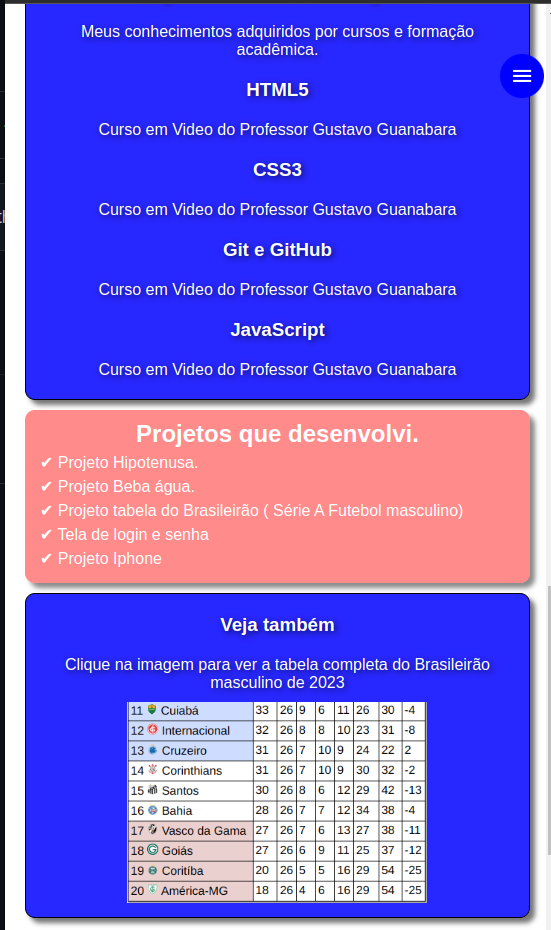

# jonhy-alberto
 Meu site oficial
 
Meu site e um pouco sobre mim

 
Na construção desse meu site ultilizei o conhecimento que adiquiri com HTML5,CSS3 e JavaScript, também mencionar que o mesmo encontra-se responsivo. Abaixo está disponível fotos e link do projeto já hospedado

 link do projeto -> https://jonhysantos.github.io/jonhy-alberto/
<a href="https://jonhysantos.github.io/jonhy-alberto/" target="_blank" rel="external">

